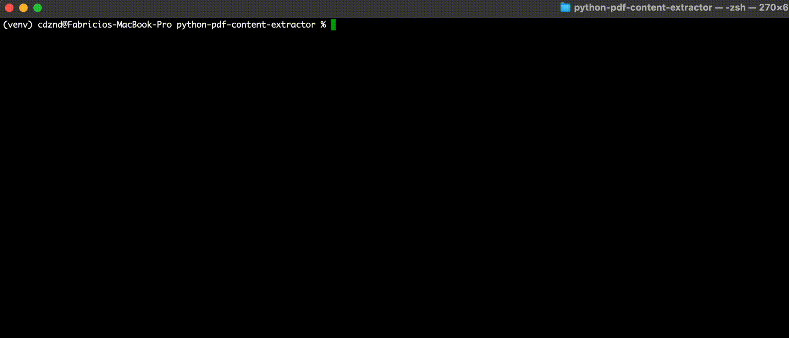

# PDF Extractor

A Python command-line tool for extracting text content from PDF files.

## Installation

```bash
# Install from source
git clone https://github.com/yourusername/pdf-extractor.git
cd pdf-extractor
pip install -e .
```

## Usage

### Command Line

```bash
# Basic usage with default directories
pdf-extractor

# Specify source and destination directories
pdf-extractor --read-from ./my_pdfs --save-to ./extracted_text

# Limit the number of pages extracted per PDF
pdf-extractor --limit 10
```

### As a Library

```python
from pdf_extractor.core.extractor import PDFExtractor

# Extract text from a PDF file
extractor = PDFExtractor()
text = extractor.extract_text("path/to/file.pdf")
print(text)

# Limit the number of pages extracted
text = extractor.extract_text("path/to/file.pdf", page_limit=5)
```

## Features

- **Progress Bars**: The tool uses `tqdm` to display real-time progress bars, showing both overall PDF processing progress and page extraction progress with estimated completion times.

<p align="center">
  
</p>

## Project Structure

```
pdf-extractor/
├── pdf_extractor/          # Main package
│   ├── __init__.py
│   ├── __main__.py         # Entry point for running as a module
│   ├── core/               # Core functionality
│   │   ├── __init__.py
│   │   └── extractor.py    # PDF extraction logic
│   └── cli/                # Command-line interface
│       ├── __init__.py
│       └── commands.py     # CLI commands
├── pdf_source/             # Default directory for source PDFs
├── LICENSE
├── README.md
├── requirements.txt
└── setup.py               # Package installation
```

## Requirements

- Python 3.7+
- PyMuPDF (for PDF processing)
- tqdm (for progress visualization)

## License

This project is licensed under the MIT License - see the LICENSE file for details.
